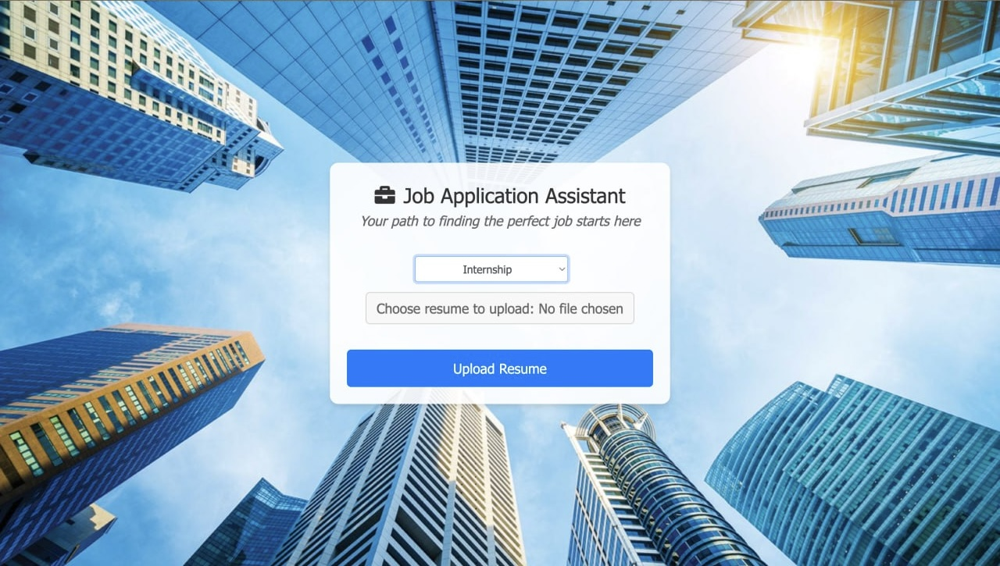
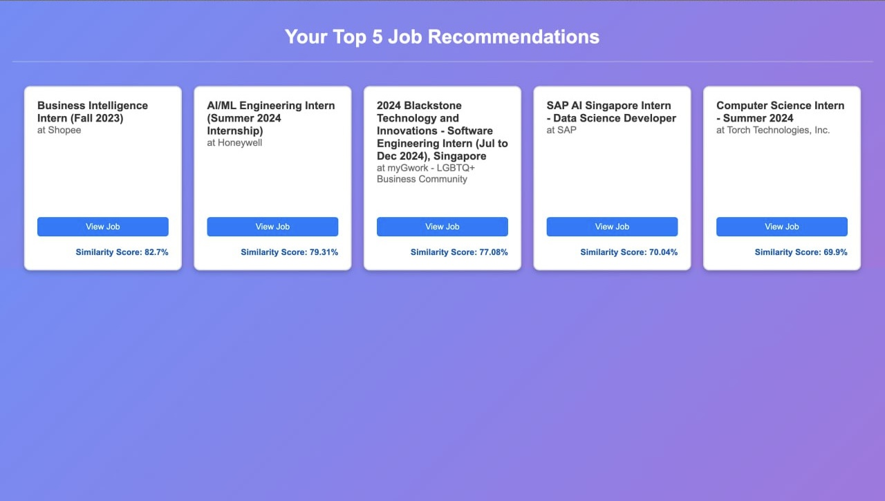
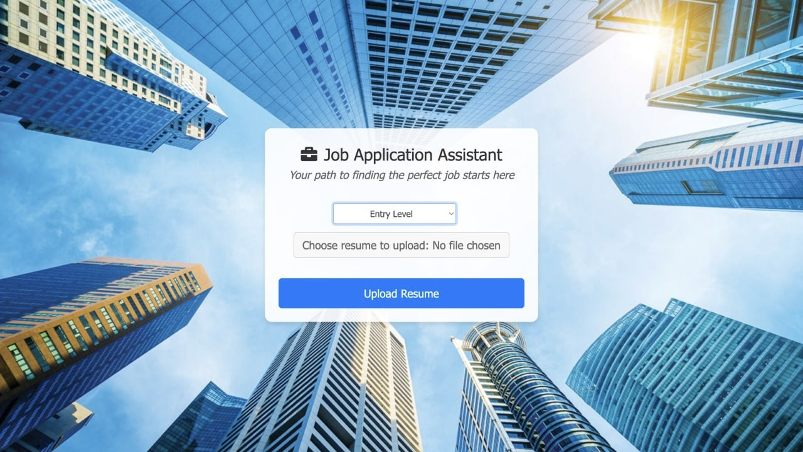

# JobAppAssistant
Job Application Assistant: Bagged transformer-based huggingface embedding models with tf-idf to recommend web-scraped real-time jobs based on uploaded resume.

## Figures of the project

*Figure 1: Page to update resume for job matching*

*Figure 2: Page with job recommendations according to input resume, with clickable links to the application page*

*Figure 3: Option to filter based on Internship, Entry-level, or Senior-level positions*

## Usage
activate venv--
source venv/bin/activate (for mac)
venv\Scripts\activate (for windows)
install dependencies

python --version
if the python version in your venv is not the same as the one that you are using: select python interpreter / unalias python
all modules are downloaded inside venv / lib / python 3.11

## Evaluations
Evaluation scores based on job relevancy to resume and whether the suggested job is a good progression from their current position.
    
    Accounting: 108 / 125

    Business development: 109 / 125

    Consulting 112 / 125

    Digital Media: 99 / 125

    Finance: 103 / 125

    Healthcare: 92 / 125

    Human Resources: 120 / 125

    Administrative: 91 / 125

    Technology: 120 / 125

    Research 105 / 125, 113 / 125 (Average of 109)
